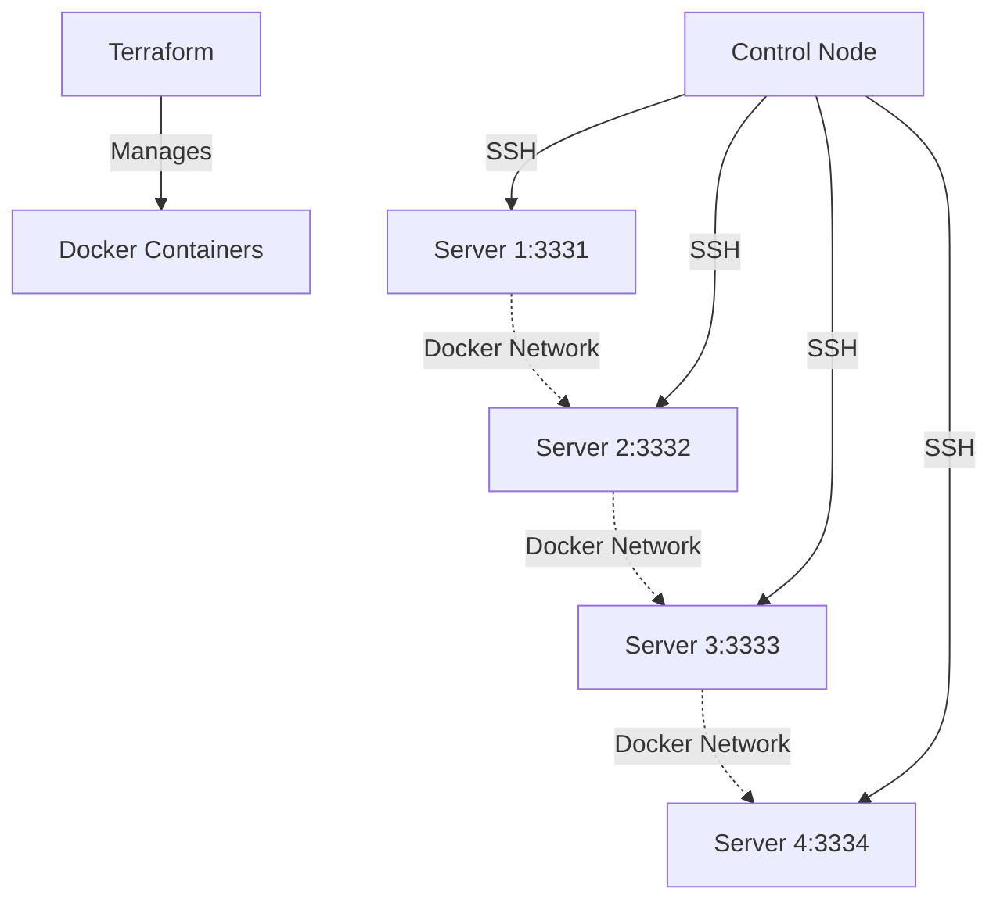

# 🐧 RH-LabX - RHCE Ansible Lab Environment

A comprehensive Docker-based lab environment designed for RHCE (Red Hat Certified Engineer) certification training and hands-on Linux administration practice.

## 📋 Table of Contents
- [Overview](#overview)
- [Features](#features)
- [Architecture](#architecture)
- [Quick Start](#quick-start)
- [Prerequisites](#prerequisites)
- [Installation](#installation)
- [Usage](#usage)
- [Configuration](#configuration)
- [Project Structure](#project-structure)
- [Testing](#testing)
- [Contributing](#contributing)
- [License](#license)

## 🎯 Overview

**RH-LabX** provides a complete containerized lab environment for RHCE certification preparation. It creates a multi-server setup with 4 Rocky Linux servers and 1 control node, pre-configured with all necessary tools for hands-on Linux administration practice.

## ✨ Features

### **Lab Environment**
- **4 Rocky Linux Server Containers** (server1-4)
- **1 Control Node** for Ansible management
- **Dedicated Docker Network** for container communication
- **SSH Access** on ports 3331-3334

### **Pre-installed Tools**
- **Ansible** for configuration management
- **Terraform** for infrastructure as code
- **Complete Web Stack** (Apache, MariaDB, PHP)
- **Network Services** (SSH, NFS, Samba)
- **System Tools** (LVM, firewalld, chrony)
- **Development Tools** (git, vim, curl, wget)

### **RHCE Curriculum Coverage**
- ✅ LVM Storage Management
- ✅ Network Service Configuration
- ✅ Web Server Administration
- ✅ Database Management
- ✅ Security Configuration
- ✅ System Automation
- ✅ Container Orchestration

## 🏗️ Architecture



## 🚀 Quick Start

### **Option 1: Using Terraform (Recommended)**
```bash
# Clone the repository
git clone https://github.com/yourusername/RH-LabX.git
cd RH-LabX

# Navigate to terraform directory
cd terraform

# Initialize Terraform
terraform init

# Deploy the lab environment
terraform apply
```

### **Option 2: Manual Docker Setup**
```bash
# Build the Docker image
docker build -t rh-labx:latest .

# Create the lab containers
docker-compose up -d
```

## 📋 Prerequisites

- **Docker** (version 20.10 or higher)
- **Docker Compose** (version 1.29 or higher)
- **Terraform** (version 1.0 or higher)
- **Git** (for cloning the repository)
- **SSH client** (for connecting to containers)

### **System Requirements**
- **OS**: Linux, macOS, or Windows with WSL2
- **RAM**: 4GB minimum, 8GB recommended
- **Storage**: 5GB free space
- **Network**: Internet connection for initial setup

## 🔧 Installation

### **Step 1: Clone Repository**
```bash
git clone https://github.com/yourusername/RH-LabX.git
cd RH-LabX
```

### **Step 2: Using Terraform**
```bash
cd terraform
terraform init
terraform plan
terraform apply
```

### **Step 3: Verify Deployment**
```bash
# Check running containers
docker ps

# Test SSH connectivity
ssh -p 3331 root@localhost
```

## 🎮 Usage

### **Connect to Lab Environment**
```bash
# Connect to individual servers
ssh -p 3331 root@localhost  # Server 1
ssh -p 3332 root@localhost  # Server 2
ssh -p 3333 root@localhost  # Server 3
ssh -p 3334 root@localhost  # Server 4

# Connect to control node
docker exec -it controlnode bash
```

### **Run Ansible Playbooks**
```bash
# From control node
cd /home/matthew
ansible-playbook -i inventory.ini playbook.yml
```

### **Practice Scenarios**
- **LVM Management**: Create, resize, and manage logical volumes
- **Web Server Setup**: Configure Apache with virtual hosts
- **Database Administration**: Set up MariaDB with user management
- **Network Services**: Configure NFS shares and Samba server
- **Security**: Implement firewalld rules and SELinux policies

## ⚙️ Configuration

### **Environment Variables**
```bash
# Optional: Customize container count
export CONTAINER_COUNT=4

# Optional: Change SSH port range
export SSH_BASE_PORT=3331
```

### **Terraform Variables**
Edit `terraform/variables.tf` to customize:
- Container count
- SSH port range
- Docker network settings

## 📁 Project Structure

```
RH-LabX/
├── 📄 README.md                    # This file
├── 📄 Dockerfile                   # Container configuration
├── 📄 entrypoint.sh               # Container startup script
├── 📄 setup_all.sh                # Main setup automation
├── 📄 rescue.sh                   # LVM recovery script
├── 📄 terraform.tfstate           # Infrastructure state
├── 📁 terraform/                  # Infrastructure as code
│   ├── 📄 main.tf                 # Docker container definitions
│   ├── 📄 variables.tf            # Configuration variables
│   ├── 📄 terraform.tfstate       # Current state
│   └── 📄 terraform.tfstate.backup # Previous state backup
└── 📁 docs/                       # Documentation (future)
```

## 🧪 Testing

### **Health Checks**
```bash
# Verify all containers are running
docker ps | grep server

# Test SSH connectivity
for port in 3331 3332 3333 3334; do
  ssh -p $port root@localhost "echo 'Server $((port-3330)) is ready'"
done
```

### **Validation Tests**
```bash
# Test LVM setup
docker exec server1 lsblk

# Test Ansible connectivity
docker exec controlnode ansible all -i inventory.ini -m ping
```

## 🤝 Contributing

We welcome contributions! Please see our [Contributing Guidelines](CONTRIBUTING.md) for details.

### **Ways to Contribute**
- 🐛 Report bugs via GitHub Issues
- 💡 Suggest new features or scenarios
- 📖 Improve documentation
- 🔧 Submit pull requests for enhancements

## 📜 License

This project is licensed under the MIT License - see the [LICENSE](LICENSE) file for details.

## 🙏 Acknowledgments

- **Red Hat** for the RHCE certification curriculum
- **Rocky Linux** community for the base container image
- **Docker** for containerization technology
- **Terraform** for infrastructure automation

## 📞 Support

- **Issues**: [GitHub Issues](https://github.com/yourusername/RH-LabX/issues)
- **Discussions**: [GitHub Discussions](https://github.com/yourusername/RH-LabX/discussions)
- **Wiki**: [Project Wiki](https://github.com/yourusername/RH-LabX/wiki)

---

**Happy Learning!** 🎓 **RH-LabX** is designed to provide hands-on experience with real-world Linux administration scenarios. Start with the quick start guide and work through the practice scenarios to build your RHCE skills.
</result>
</attempt_completion>
